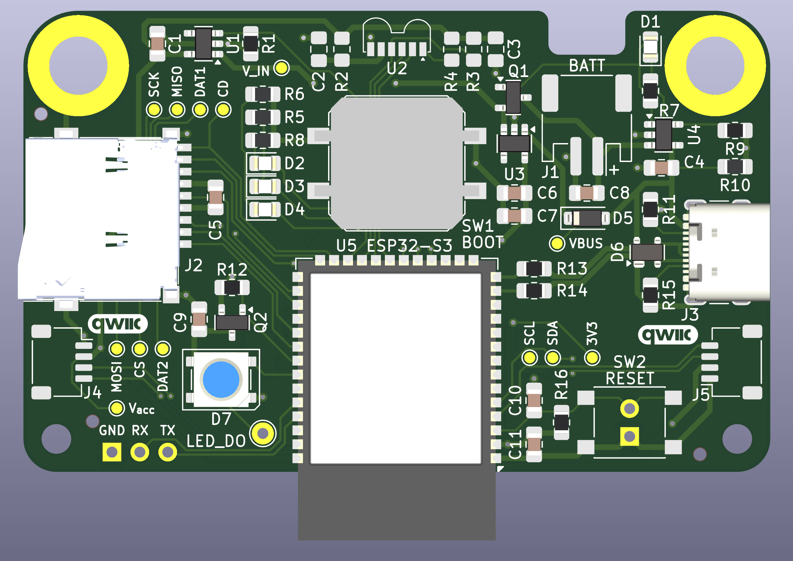
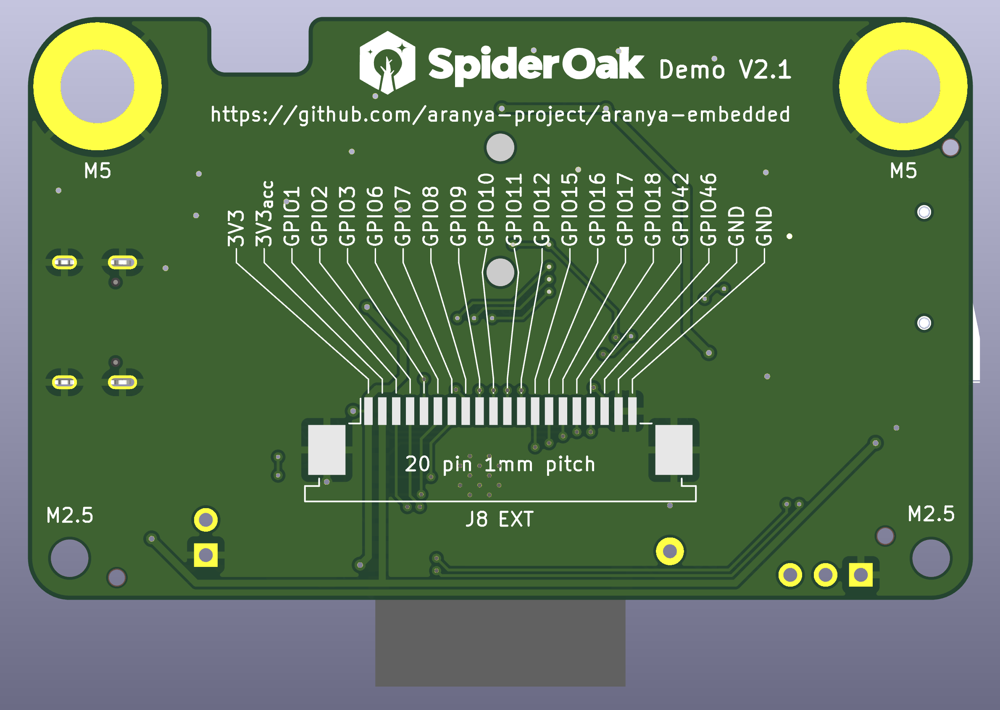

# SpiderOak Demo V2 Board

This is a demonstration board for [Aranya
Embedded](https://github.com/aranya-project/aranya-embedded) built around the
ESP32-S3. It provides various peripheral options used by the [Aranya Embedded
demo](https://github.com/aranya-project/aranya-embedded/crates/demo-esp32-s3/).

## Board View

<a href="images/front.png"></a>
<a href="images/back.png"></a>

## Assembly Options

The IR transceiver U2 is necessary if you intend ot use IR networking. It uses
the Vishay TFBS4711 which is somewhat pricey, so it has not been included by
default.

The battery jack is a 2mm pitch JST PH connector, and the Qwiic connectors are
1mm pitch JST SH connectors. The RGB LED is a WS2812 5mm LED module. The SD card
slot is a SameSky MSD-4-A, and the USB jack is a GCT USB4105. If you search
around you will find many alternatives for these as they are very commonly used.

A footprint is provided but not populated for reset switch - a SMD 6mm tactile
switch (Omron B3FS or similar). Likewise there is an unpopulated 20pin expansion
header on the back - details on that [below](#test-points-and-expansion).

## Power

Input power comes from either the battery or the USB input. A schottky diode and
a P-channel MOSFET (D5 and Q1) switch power between them and prevent USB power
from backfeeding into the battery. The battery is charged by a standard 500mA
5-pin single-cell lithium linear charge controller (TPS4054/MCP73831/etc), and
LED D1 will light when charging is complete.

The ESP32 is powered by a primary 3.3V regulator (the TLV74333), and all other
devices (IR transceiver, SD card slot, and any Qwiic accessories) are powered
by a secondary 3.3V regulator enabled by a high output on GPIO 47.

Separately, power to the RGB LED is switched via an open drain output on GPIO
40. This pin must be brought low to turn on the P-channel MOSFET controlling
power to the LED. The LED power is connected to input power (either the USB or
battery) directly, so it is not controlled by the accessory power regulator.

### Pin Summary

| GPIO Pin | Function | Operation |
|----------|----------|-----------|
| 47 | Accessory power enable | output, active high |
| 40 | LED power enable | open drain output, active low |

## IR Transceivers

IR1 is connected to UART1 TX/RX on pins on GPIOs 13 and 14, respectively. The IR
transceiver has to be enabled with a low output on GPIO 21.

Enabling IrDA mode requires setting `UART_IRDA_EN` in `UART_CONF0_REG`.
Additionally, to transmit, you need to set `UART_IRDA_TX_EN`. By default, IrDA
mode is half duplex, and `UART_IRDA_TX_EN` needs to be toggled to switch between
transmit and receive modes. To enable both transmit and receive at the same
time, which will echo all transmitted data through the RX line, set
`UART_IRDA_DPLX`.

For reasons I don't understand, the only thing that can be set via IDF APIs is
enabling IrDA mode. All of the other IrDA settings are not available via IDF
APIs, so you will likely have to twiddle the registers directly. In C, this can
be done by including `soc/uart_struct.h` and using the bitfield structs
provided. e.g.

```
UART1.conf0.irda_dplx = 1;
```

### Pin Summary

| GPIO Pin | Function | Operation |
|----------|----------|-----------|
| 13 | Transmit | output |
| 14 | Receive | input |
| 21 | Enable | output, active low |

## Micro SD

The SD card is connected to SPI such that it should be usable directly
through the IOMUX on IOs 35, 36, and 37. CS is connected to GPIO 38.
The slot has card detect functionality, which is connected to GPIO 48.

Additionally, DAT1 and DAT2 (only used in SD mode) are connected to
GPIOs 45 and 39, respectively, so you should theoretically be able to
enable 4-bit SD through the SD/MMC controller.

### Pin Summary (SPI mode)

| GPIO Pin | Function | Operation |
|----------|----------|-----------|
| 36 | SCK | output |
| 35 | MOSI | output |
| 37 | MISO | input |
| 38 | CS | output |

### Pin Summary (SD 1-bit mode)

| GPIO Pin | Function | Operation |
|----------|----------|-----------|
| 36 | CLK | output |
| 35 | CMD | input/output |
| 37 | DAT0 | input/output |
| 38 | CD | input |

### Pin Summary (SD 4-bit mode)

| GPIO Pin | Function | Operation |
|----------|----------|-----------|
| 36 | CLK | output |
| 35 | CMD | input/output |
| 37 | DAT0 | input/output |
| 45 | DAT1 | input/output |
| 39 | DAT2 | input/output |
| 38 | DAT3 | input/output |

### Pin Summary (card detect)

| GPIO Pin | Function | Operation |
|----------|----------|-----------|
| 48 | card detect | input, pull-up, active low |

## Debug LEDs

Three LEDs are hooked up to GPIOs 10-12, and can be used for any purpose.

### Pin Summary

| GPIO Pin | Function | Operation |
|----------|----------|-----------|
| 10 | Debug LED 1 | output, active high |
| 11 | Debug LED 2 | output, active high |
| 12 | Debug LED 3 | output, active high |

## Test points and expansion

The unused GPIOs 1-3, 6-9, 15-18, 42, and 46; the debug LED GPIOs 10-12; as
well as the main and accessory 3.3V regulators; and GND are broken out via a
20-pin 1mm pitch flat flex footprint on the back. You can either install a flat
flex connector or wire directly to the pads.

Test points are provided for VBUS (USB power), V_IN (OR'd power between VBUS and
VBATT), main 3V3, V<sub>acc</sub> (accessory power), SCL/SDA connected to the
Qwiic ports, and SCK, MOSI, MISO, CS, DAT1, DAT2 and CD on the SD card slot.

A three-pin 0.1" header is available for TX, RX, and GND for UART0, and a single
pin header is available for the DO pin on the WS2812 LED module. There are also
0.1" pin headers for the reset switch inside the tactile switch footprint.

## Mechanical

The board is 68mm wide and 42mm tall (2.68 x 1.66 inches). The ESP32-S3 module's
antenna hangs off of the bottom of the board, making the full height 48.4mm
(1.91 inches).

At the top are two M5 sized plated holes meant to accomodate lanyard hooks. They
are centered 5mm from the edges. At the bottom are two more M2.5 holes for any
other mounting needs, centered 3mm from the edges.

A 7x4mm cutout is provided near the battery connector in the top right of the
board. This allows any battery cables to be routed below the board even if the
board is mounted flush against a case.
